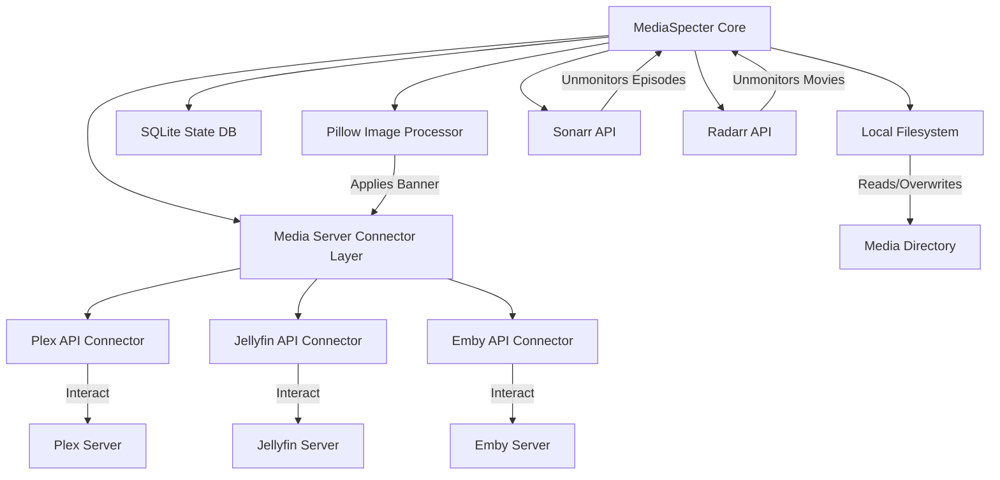

# MediaSpecter: Multi-Server Watched-Media Storage Reclaimer


**MediaSpecter** is a media-server-agnostic utility designed to help administrators reclaim disk space from their Plex, Jellyfin, or Emby libraries. It replaces watched media files (Movies and TV episodes) with tiny, valid dummy video files (approx. 20KB). This reclaims disk space while keeping watch history, metadata, and browseability fully intact. 

To visually flag archived items, MediaSpecter synthesizes and uploads a clean translucent banner overlay on the media poster (e.g., `ARCHIVED • 8.4 GB SAVED`) and integrates with Radarr and Sonarr to prevent automatic re-downloads.

---

## Features
- 🚀 **Multi-Server Connectors**: Seamless support for Plex (via `plexapi`), Jellyfin, and Emby (via REST APIs).
- 🔗 **Cross-Server State Propagation**: Run Plex, Jellyfin, and Emby against one shared library? Archive once, badge everywhere. MediaSpecter matches the same physical item across every enabled server — by file path first, falling back to external IDs (TMDB → IMDB → TVDB) — then replaces the file once and propagates the poster overlay and archived state to each server. Restore fans out the same way.
- 🎬 **TMDB ID Bridge** *(optional)*: When servers store different ID systems (e.g. Plex has only IMDB while Jellyfin has only TMDB), an optional TMDB API key normalizes IDs across systems so matching still succeeds. Without a key, matching gracefully falls back to file path + direct ID overlap.
- 🎥 **Valid Dummy Containers**: Programmatic generation of compliant, non-crashing `.mp4`, `.mkv`, and `.avi` template containers.
- 🎨 **Poster Badging**: Adds a sleek translucent banner (mint accent) at the bottom of posters detailing reclaimed space using Pillow.
- 🤖 **\*Arr Integrations**: Automatically unmonitors movies in Radarr and episodes in Sonarr to prevent automatic re-downloads. Matching is robust to differing mount roots (by TMDB/IMDB/TVDB id, then path). A per-item **Monitor / Unmonitor toggle** in the dashboard lets you re-monitor a title on demand (e.g. to let the \*Arr fetch the full file again).
- 🛡️ **Safety & Recovery**: 
  - **Dry-run mode** by default to inspect candidates and potential savings safely.
  - Option to move original media files to cold storage backups.
  - One-command restoration (`--restore`) to re-upload original posters and update the database state.
- ⚙️ **Custom Exclusion Rules**: Filter candidates by watch age (`min_age_days`), metadata labels, genres, or directory paths.
- 🏷️ **Archive Tagging** *(optional)*: Stamp every archived item with a custom metadata tag on Jellyfin/Emby (a label on Plex) and remove it again on restore — perfect for hiding archived media from users, e.g. via Jellyfin's per-user "Block items with tags" setting.

---

## System Architecture



---

## Installation

Ensure you have Python 3.8+ installed.

1. **Clone the Repository** (or move into the project directory):
   ```bash
   cd /home/jakwgrav/Projects/mediaspecter
   ```

2. **Install Required Dependencies**:
   ```bash
   pip install requests pyyaml Pillow plexapi
   ```
   *(Note: `plexapi` is optional and only required if using a Plex media server).*

---

## Deploy on Unraid (Docker)

MediaSpecter must run somewhere it can **read and write the actual media files**. If your
servers run in containers (e.g. on Unraid), run MediaSpecter as a container too and mount the
media share at the **exact same path your Plex/Jellyfin/Emby containers use** (commonly `/data`).
That way the paths the servers report resolve 1:1 on disk — no path translation needed.

A multi-arch image is published to GHCR by CI on every push to `main` and every `vX.Y` tag:

```bash
docker run -d \
  --name mediaspecter \
  -p 5000:5000 \
  -e PUID=99 -e PGID=100 -e UMASK=022 \
  -v /mnt/user/appdata/mediaspecter:/config \
  -v /mnt/user/data:/data \
  ghcr.io/gillberg1111/mediaspecter:latest
```

- **`/config`** — holds `config.yaml`, the SQLite DB, and poster backups (persisted). A default
  config is seeded on first run; edit it in the dashboard's **Settings** tab.
- **`/data`** — your media. **Map it to the same container path your other media containers use**,
  with read/write access, so `/data/movies/…` etc. line up.
- **`PUID` / `PGID`** — the container drops from root to this user/group (default `99:100` =
  `nobody:users` on Unraid), so the dummy files it writes match the rest of your array instead of
  being owned by `root:root`. `UMASK` (default `022`) controls their permissions.

Then open `http://<unraid-ip>:5000`. On Unraid you can also add it as a Docker container via the
template UI using the same image and the two volume mappings above.

> **Why this matters:** running MediaSpecter on a different host than the files (or with a
> mismatched `/data` mount) yields `Permission denied` / `No such file` errors when archiving —
> it can't reach the files. Same-path, writable mount fixes it.

---

## Migrating from MediaSpektor (the old name)

MediaSpektor was renamed to **MediaSpecter** in v2.0.0. Because the Docker image and Unraid
Community Applications template both changed name, Unraid treats the new app as a **separate
install** — it does **not** auto-upgrade in place, and your old data isn't carried over until you
move it. There is no in-app migration prompt; you do it once at the filesystem level.

Everything you care about lives in the old install's `/config` appdata folder:

- `config.yaml` — servers, tokens, rules, integrations
- `mediaspektor.db` — archive state (archived items, rollup badges, manual matches)
- `backups/` — original posters + overlays (needed for **Restore** and badge-revert)

Paths stored *inside* the database are container-internal (`/config/backups/…` for posters,
`/data/…` for media), so they stay valid as long as the new container mounts `/config` and `/data`
the same way — nothing inside the DB needs editing.

**Option A — reuse the old appdata (easiest, no copying).** Point the new MediaSpecter container's
`/config` at the *old* folder (e.g. `/mnt/user/appdata/mediaspektor`). On first start MediaSpecter
auto-renames `mediaspektor.db → mediaspecter.db` in place; config, DB, and backups are already there.
(Only cosmetic downside: the folder keeps the old name.)

**Option B — copy into a fresh `mediaspecter` appdata folder.** Stop the MediaSpecter container, then
on the Unraid terminal:

```bash
cp -a /mnt/user/appdata/mediaspektor/config.yaml  /mnt/user/appdata/mediaspecter/config.yaml
cp -a /mnt/user/appdata/mediaspektor/backups/.      /mnt/user/appdata/mediaspecter/backups/
# copy the DB AS the new name (overwrites the fresh empty one)
cp    /mnt/user/appdata/mediaspektor/mediaspektor.db /mnt/user/appdata/mediaspecter/mediaspecter.db
# let the container user own it (Unraid default 99:100 — match your PUID/PGID)
chown -R 99:100 /mnt/user/appdata/mediaspecter
```

Then start MediaSpecter. The dashboard's **Total reclaimed** and the Movies/TV grids should show your
previously-archived items.

> **Gotcha:** copy the database *as* `mediaspecter.db` (as above). If you copy it as
> `mediaspektor.db` while a `mediaspecter.db` already exists in the folder, the automatic rename is
> skipped (it only runs when no `mediaspecter.db` is present) and you'll keep the empty one. If
> posters or Restore misbehave afterward, it's almost always a `/config` ownership issue — re-run the
> `chown` with your actual PUID/PGID.

---

## Configuration

Copy the template configuration file:
```bash
cp config.yaml.example config.yaml
```

Edit `config.yaml` to specify your servers, rules, and integration details:

```yaml
# MediaSpecter Configuration
servers:
  - type: "plex"
    enabled: true
    url: "http://localhost:32400"
    token: "YOUR_PLEX_TOKEN"
    libraries: ["Movies", "TV Shows"]

  - type: "jellyfin"
    enabled: false
    url: "http://localhost:8096"
    username: "YOUR_JELLYFIN_USERNAME"   # Jellyfin authenticates by username/password
    password: "YOUR_JELLYFIN_PASSWORD"   # a user token + user_id are derived at runtime
    libraries: ["Movies", "Shows"]       # Jellyfin's default TV library is named "Shows"

  - type: "emby"
    enabled: false
    url: "http://localhost:8096"
    api_key: "YOUR_EMBY_API_KEY"
    user_id: "YOUR_EMBY_USER_ID"         # username or user GUID (resolved at startup)
    libraries: ["Movies", "TV Shows"]

tagging:
  enabled: false               # Optional: tag archived items so you can filter/hide them
  tag: "archived"              # Metadata tag on Jellyfin/Emby, label on Plex; removed on restore

rules:
  min_age_days: 7              # Only archive items watched at least 7 days ago
  exclude_labels: ["keep"]     # Ignore items with this metadata label
  exclude_genres: ["Documentary"]
  dummy_threshold_mb: 15       # Files smaller than 15MB are ignored

aesthetics:
  enable_poster_overlay: true
  banner_color: [8, 11, 10, 204]  # RGBA (near-black, 80% opacity)
  border_color: [62, 207, 142, 255] # RGBA (mint accent)
  font_name: "Arial"
  font_size_ratio: 0.045       # Font size relative to poster height

integrations:
  radarr:
    enabled: false
    url: "http://localhost:7878"
    api_key: "YOUR_RADARR_KEY"
  sonarr:
    enabled: false
    url: "http://localhost:8989"
    api_key: "YOUR_SONARR_KEY"
  tmdb:
    api_key: ""                  # Optional. Bridges ID systems for cross-server matching.
                                 # Supports a v3 API key or v4 bearer token; also reads TMDB_API_KEY.

safety:
  dry_run: true                # Default safety mode
  backup_original_media: false
  backup_directory: ""              # blank = <config dir>/backups; set a path only if you keep media backups elsewhere
```

> **Library names are per-server and must match each server's actual library names.** Plex, Jellyfin, and Emby name their TV library differently by default — Plex uses `TV Shows`, while Jellyfin uses `Shows`. Set each server's `libraries` to what that server actually calls them. If a name doesn't match, MediaSpecter logs the available names for that server (e.g. `jellyfin: library 'TV Shows' not found. Available: Movies, Shows, ...`) so you can correct it. Matching is case-insensitive.

---

## Self-Hosted Web Dashboard

MediaSpecter features a sleek, self-hosted dark web dashboard where you can browse watched/unwatched movies and TV shows, explore seasons/episodes, view live backend logging, inspect storage reclamation statistics, and manually initiate "Specter" (archive/replace) or "Restore" actions.

### Running the Web Dashboard

To boot the FastAPI web server, simply run the script without any action flags:
```bash
python3 mediaspecter.py --host 127.0.0.1 --port 5000
```
Open `http://localhost:5000` in your web browser to access the dashboard.

### Dashboard Key Features
- 📊 **Real-time Statistics**: Shows total items processed and space saved.
- 📺 **Visual Catalog**: Pulls poster artwork directly from Plex/Jellyfin/Emby with a custom image proxy.
- ⚡ **Manual Action Confirmation**: Confirmation modal before executing any "Specter" or "Restore" operations.
- 📝 **Live Activity Log Console**: Follow log output in real-time.
- ⚙️ **Config Manager**: Edit your configuration directly in the browser via structured Settings fields.
- 📲 **Installable (PWA)**: Add to Home Screen on iOS/Android for an app-like launch with the MediaSpecter icon.
- 🔒 **Dashboard Security**: Optional username/password login (managed in Settings); on first run you're required to replace the default password before continuing.

---

## Usage Guide (CLI)

You can also run MediaSpecter via the command line interface:

### 1. Scan / Inspect Space Savings (Dry-Run)
Scan library watched files and report what would be archived and how much space is saved:
```bash
python3 mediaspecter.py --scan
```

### 2. Run Archive Execution
Execute the archival workflow (make sure to set `safety.dry_run: false` in `config.yaml` or use the script to run it):
```bash
python3 mediaspecter.py --archive
```
*To force a live run, change `dry_run` to `false` in `config.yaml` or pass the `--config` parameter with a custom live config.*

### 3. Check Archive Statistics
Inspect historical space savings and archive logs:
```bash
python3 mediaspecter.py --stats
```

### 4. Restore an Item
Revert the dummy file, restore the original poster backup to the server, and update the database record status:
```bash
python3 mediaspecter.py --restore <server_type> <server_item_id>
```
*Example:*
```bash
python3 mediaspecter.py --restore plex 12345
```

---

## Running Tests
Run the self-contained unit tests to verify database, poster, and API clients:
```bash
python3 -m unittest test_mediaspecter.py
```

---

## Automation (Cron Job)
To run MediaSpecter automatically every night at 2:00 AM, add a cron job:

```bash
crontab -e
```

And append:
```cron
0 2 * * * cd /home/jakwgrav/Projects/mediaspecter && python3 mediaspecter.py --archive >> mediaspecter.log 2>&1
```
